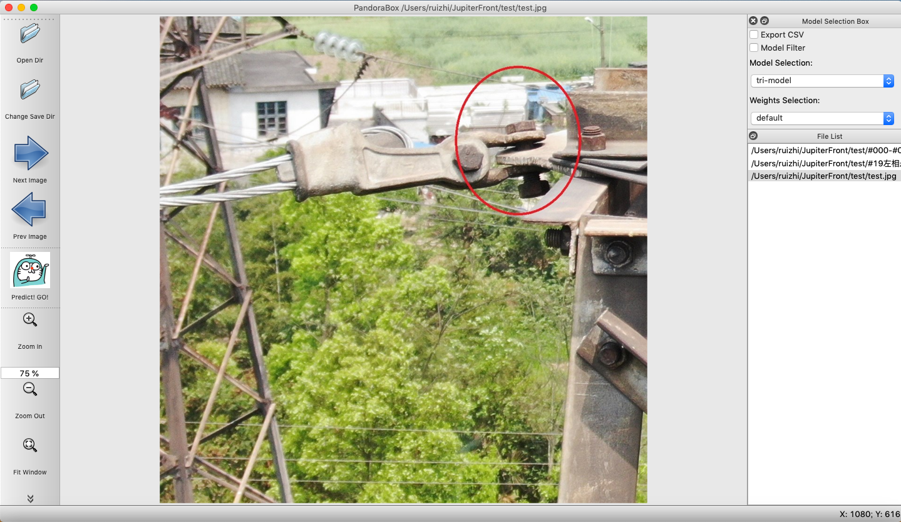
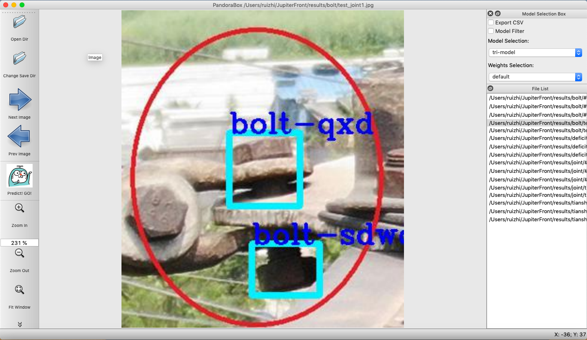

# PandoraBox
PandoraBox is my first self-developed client server for object detection model predictions. Its structure was transferred from a popular annotation client server named LabelImg. 
The application realized the batch visualization of pre- and post- processed images from the directed path.
In terms of model-related arguments, there are two embedded object detection models can be used (model weights files were deleted for the term confidentials). The model can be checked to filter out images that just detected to exist objects. A .csv file can also be checked to export about object labels and coordinates on images.

